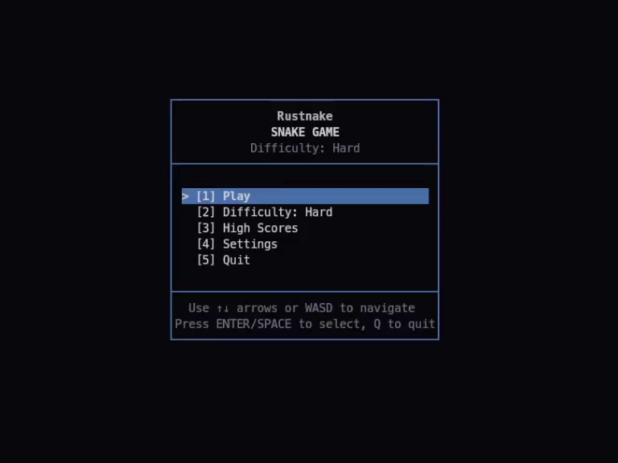

# Rustnake

[](https://github.com/MiguelRegueiro/rustnake/releases) [](https://crates.io/crates/rustnake) [](https://github.com/MiguelRegueiro/rustnake/actions/workflows/ci.yml) [](LICENSE) [](https://www.rust-lang.org/)

Classic Snake for the terminal, built in Rust.



## Quick Start

```bash
cargo install rustnake --locked
rustnake
```

Update to the latest published version:

```bash
cargo install rustnake --locked --force
```

`--locked` keeps dependency resolution reproducible.

## Install Options

### crates.io (recommended)

```bash
cargo install rustnake --locked
```

By default, Cargo installs binaries to `~/.cargo/bin` (or your configured Cargo bin directory).

### Prebuilt binaries (GitHub Releases)

Windows (PowerShell):

```powershell
$InstallDir = Join-Path $env:LOCALAPPDATA "Rustnake"
New-Item -ItemType Directory -Force -Path $InstallDir | Out-Null
Invoke-WebRequest -Uri "https://github.com/MiguelRegueiro/rustnake/releases/latest/download/rustnake-windows-x86_64.exe" -OutFile (Join-Path $InstallDir "rustnake.exe")
& (Join-Path $InstallDir "rustnake.exe")
```

Update:

```powershell
$InstallDir = Join-Path $env:LOCALAPPDATA "Rustnake"
Invoke-WebRequest -Uri "https://github.com/MiguelRegueiro/rustnake/releases/latest/download/rustnake-windows-x86_64.exe" -OutFile (Join-Path $InstallDir "rustnake.exe")
```

macOS:

```bash
curl -fL https://github.com/MiguelRegueiro/rustnake/releases/latest/download/rustnake-macos-universal2 -o rustnake
chmod +x rustnake
sudo install -m 755 rustnake /usr/local/bin/rustnake
rustnake
```

Update:

```bash
curl -fL https://github.com/MiguelRegueiro/rustnake/releases/latest/download/rustnake-macos-universal2 -o rustnake
chmod +x rustnake
sudo install -m 755 rustnake /usr/local/bin/rustnake
```

Linux:

```bash
curl -fL https://github.com/MiguelRegueiro/rustnake/releases/latest/download/rustnake-linux-x86_64 -o rustnake
chmod +x rustnake
./rustnake
```

Update:

```bash
curl -fL https://github.com/MiguelRegueiro/rustnake/releases/latest/download/rustnake-linux-x86_64 -o rustnake
chmod +x rustnake
```

### Build from source

```bash
git clone https://github.com/MiguelRegueiro/rustnake.git
cd rustnake
cargo build --release --locked
cargo run --release --locked
```

Optional helper script:

```bash
./run.sh           # release mode (default)
./run.sh --dev     # debug mode
./run.sh --help
```

## Gameplay

| Action | Key |
| --- | --- |
| Move | `WASD` or `Arrow Keys` |
| Pause | `P` |
| Mute | `M` |
| Confirm menu option | `ENTER` or `SPACE` |
| Select menu option directly | `1`-`6` |
| Quit | `Q` |

## Features

- Wrap-around movement (Nokia style).
- Four difficulty levels: `Easy`, `Medium`, `Hard`, `Extreme`.
- Power-ups for speed, score, and size effects.
- Dynamic pace scaling by score and difficulty.
- Per-difficulty high scores.
- Localized UI: `en`, `es`, `ja`, `pt`, `zh`.
- Responsive layout with terminal resize support.

## Requirements

- Rust `1.85+` (Edition 2024) for source builds.
- Primary tested target: Linux `x86_64-unknown-linux-gnu`.
- Terminal with Unicode font support and ANSI escape sequence support.

## Configuration and Data

Config file locations:
- Linux: `~/.rustnake.toml`
- macOS: `~/Library/Application Support/Rustnake/config.toml`
- Windows: `%APPDATA%\Rustnake\config.toml`
- Fallback: `./.rustnake.toml` (if platform/user env vars are unavailable)

Persisted data includes:

- `high_scores` by difficulty
- user `settings` (language, pause on focus loss, sound, default difficulty)
- `config_version` for migration handling

High scores and settings persist across binary replacements/updates.

## Development

```bash
cargo fmt --all --check
cargo check --all-targets --all-features --locked
cargo clippy --all-targets --all-features --locked -- -D warnings
cargo test --all-targets --all-features --locked
```

## Release Operations

1. Ensure all quality commands pass locally.
2. Update [`CHANGELOG.md`](CHANGELOG.md).
3. Commit and push to `main`.
4. Create and push a semver tag (`vX.Y.Z`).
5. GitHub Actions release workflow validates the tag/changelog, publishes GitHub release notes from `CHANGELOG.md`, uploads platform binaries, and publishes to crates.io via Trusted Publisher.

## Troubleshooting

- Terminal too small: resize until the warning clears (minimum baseline `40x25`; some languages require wider terminals).
- Display artifacts after resize: resize once more to force a full redraw.
- Missing bell/sound cue: terminal bell may be disabled by local settings.

## Changelog

[CHANGELOG.md](CHANGELOG.md)

## License

MIT. See [LICENSE](LICENSE).
