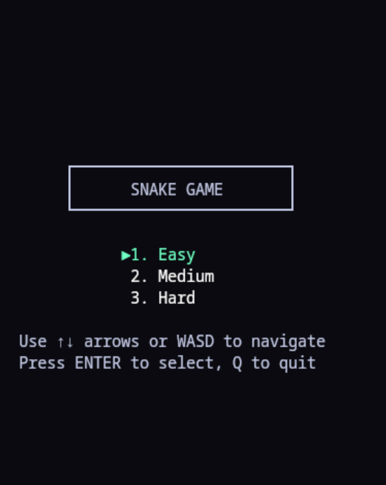
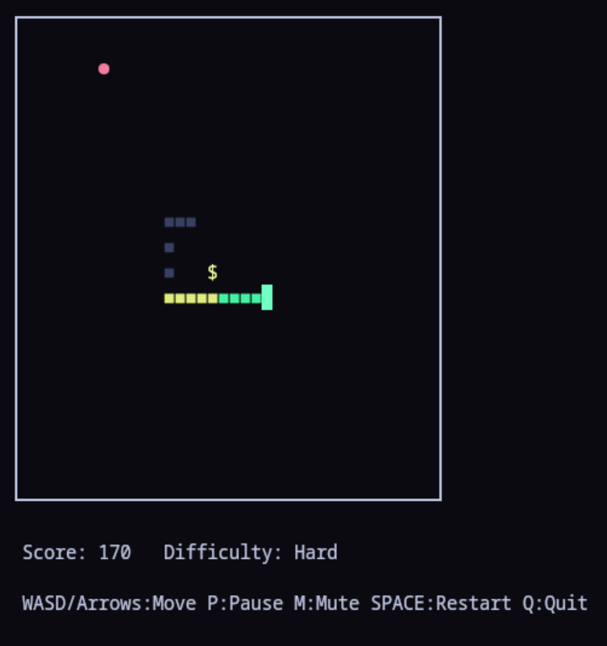
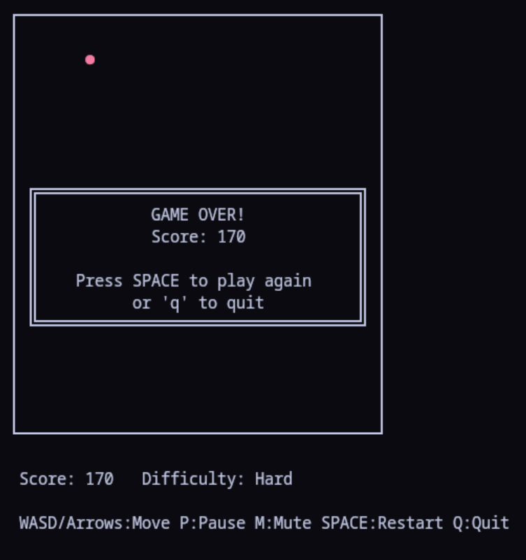

# 🐍 Rustnake

A modern, high-performance take on the classic Snake game, built with **Rust** for the terminal. Experience nostalgic Nokia-style gameplay enhanced with gradients, power-ups, and optimized CLI rendering.

## ✨ Key Features

* **Modern Visuals:** Colorful terminal display featuring a smooth gradient-colored snake.
* **Power-Up System:** 5 unique items to shift gameplay dynamics.
* **Nokia Logic:** Authentic wall-wrapping mechanics (no "wall" deaths).
* **Performance:** Optimized rendering using `crossterm` for zero-flicker gameplay.
* **Milestone Rewards:** Special food spawns at score milestones to keep the pace exciting.

---

## 🎮 Gameplay Preview

| Difficulty Selection | Active Gameplay | Game Over Screen |
| :---: | :---: | :---: |
|  |  |  |

---

## 🚀 Installation & Running

### Option 1: Download Pre-compiled Binary (Recommended)

The latest pre-compiled binaries for **Rustnake** can be found on the [Releases Page](https://github.com/MiguelRegueiro/rustnake/releases).

**Available Binaries:**

* **Linux x86_64**: Compiled on CachyOS, compatible with most modern 64-bit Linux distributions (Ubuntu, Fedora, Arch, Debian, etc.)

**Compatibility Notes:**

* The Linux binary requires glibc 2.17 or newer (virtually all modern distributions)
* If you encounter issues with the pre-compiled binary, building from source is recommended
* For other platforms (macOS, Windows), building from source is currently the only option

**To Install & Run on Linux:**

```bash
# 1. Download the binary from the releases page
wget https://github.com/MiguelRegueiro/rustnake/releases/latest/download/rustnake -O rustnake

# 2. Make it executable
chmod +x rustnake

# 3. Run the game
./rustnake

```

**Alternative Download Methods:**

```bash
# Using curl
curl -L https://github.com/MiguelRegueiro/rustnake/releases/latest/download/rustnake -o rustnake
chmod +x rustnake
./rustnake

```

### Option 2: Build from Source

**Prerequisites:**

* [Rust & Cargo](https://rustup.rs/) (Latest stable)

**Platform-Specific Setup:**

* **Linux (Ubuntu/Debian):**
```bash
sudo apt update
sudo apt install build-essential curl
curl --proto '=https' --tlsv1.2 -sSf https://sh.rustup.rs | sh
source ~/.cargo/env

```


* **Linux (Fedora/RHEL):**
```bash
sudo dnf install gcc-c++ make curl
curl --proto '=https' --tlsv1.2 -sSf https://sh.rustup.rs | sh
source ~/.cargo/env

```


* **Linux (Arch):**
```bash
sudo pacman -S base-devel curl
curl --proto '=https' --tlsv1.2 -sSf https://sh.rustup.rs | sh
source ~/.cargo/env

```


* **macOS:**
```bash
# Install Xcode command line tools
xcode-select --install

# Install Rust
curl --proto '=https' --tlsv1.2 -sSf https://sh.rustup.rs | sh
source ~/.cargo/env

```


* **Windows:**
```cmd
# Download and run the Rust installer
# Visit https://www.rust-lang.org/tools/install or use:
curl -O https://win.rustup.rs/x86_64
rustup-init.exe

```


**Build Instructions:**

```bash
# 1. Clone the repository
git clone https://github.com/MiguelRegueiro/rustnake.git
cd rustnake

# 2. Build and run in release mode (recommended for best performance)
cargo run --release

# 3. Or build the executable separately
cargo build --release
./target/release/rustnake

```

> **Note:** Building from source ensures compatibility with your specific system configuration and is the recommended approach if the pre-compiled binary doesn't work on your system.

---

## 🕹️ Controls

| Action | Key(s) |
| --- | --- |
| **Move** | `Arrow Keys` or `WASD` |
| **Pause** | `P` |
| **Mute SFX** | `M` |
| **Reset/Menu** | `SPACE` |
| **Quit** | `Q` |

**Menu Navigation:**

* Use `Arrow Keys` or `WASD` to navigate difficulty options
* Press `ENTER` or `SPACE` to confirm selection
* Press `1`, `2`, or `3` for quick difficulty selection

---

## 🍎 Game Elements

### Food System

* **Basic Food** (●): +10 Points. Grows snake by 1 segment.
* **Special Food** (★): Spawns every **50 points**. A visual milestone reward!

### Power-Ups

Power-ups have a **30% spawn chance** and effects last for **100 ticks**.

| Icon | Type | Effect |
| --- | --- | --- |
| `>` | **Speed Boost** | Increases snake velocity temporarily. |
| `<` | **Slow Down** | Decreases velocity (ideal for tight maneuvers). |
| `$` | **Bonus** | Instant +50 points. |
| `+` | **Grow** | Adds 2 segments to the snake. |
| `-` | **Shrink** | Removes 2 segments (minimum 3 segments kept). |

---

## 🛠️ Technical Architecture & Engineering Insights

**Rustnake** is built with a decoupled, modular architecture designed to separate game state logic from terminal rendering. This ensures the engine remains high-performance and easily customizable.

### Project Structure

* **`core/` (The Brain):** Manages the game state, including the Snake entity, fruit spawning logic, and collision physics.
* **`render/` (The Painter):** Handles raw ANSI escape codes and calculates RGB color gradients for smooth visual transitions.
* **`input/` (The Nervous System):** Utilizes non-blocking input polling to ensure the game loop never stutters while waiting for a keystroke.
* **`utils/` (The Config):** Centralized location for shared constants, types, and the game's "DNA."

### The Aspect Ratio Problem

In a terminal, characters are typically twice as tall as they are wide. To achieve a "classic" square-movement feel, **Rustnake** implements **Aspect Ratio Correction**. By tuning the horizontal-to-vertical tick ratio at 1:2, the snake appears to move at a uniform speed regardless of direction.

| Difficulty | Horizontal Tick | Vertical Tick |
| --- | --- | --- |
| **Easy** | 150ms | 300ms |
| **Medium** | 100ms | 200ms |
| **Hard** | 60ms | 120ms |

### Customization & Hacking

The core engine is designed for experimentation. You can modify `src/utils/mod.rs` to change the game's fundamental behavior:

* **`WIDTH` / `HEIGHT`**: Redefine the play area grid dimensions.
* **`TICK_RATE`**: Globally scale the game speed and heartbeat.
* **`COLORS`**: Adjust the linear interpolation values for the snake's gradient body.

---

## 🚀 Development & Deployment Goals

This project served as a deep dive into the professional Rust ecosystem, moving beyond simple code to full-cycle software distribution:

* **CI/CD Automation:** Leveraged **GitHub Actions** to automate build testing and release cycles.
* **Standardized Distribution:** Implemented a Linux binary distribution strategy with `glibc` compatibility checks to ensure the game runs across various modern distributions.
* **Professional Documentation:** Modeled after industry-standard CLI tools (like `bat` or `ripgrep`), providing clear, idempotent installation paths via `wget`, `curl`, and source compilation.

---

## 📄 License

This project is licensed under the MIT License - see the [LICENSE](LICENSE) file for details.

